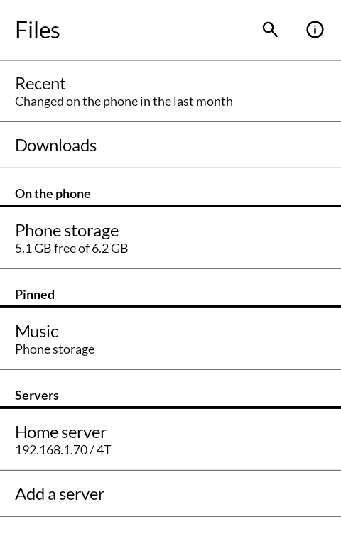
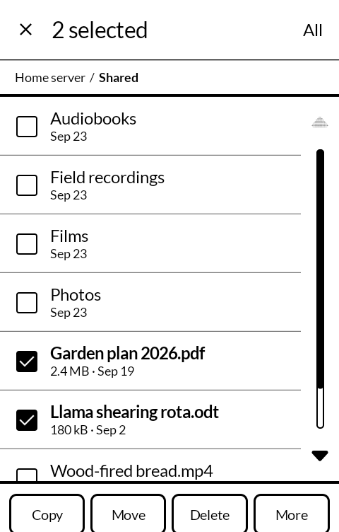
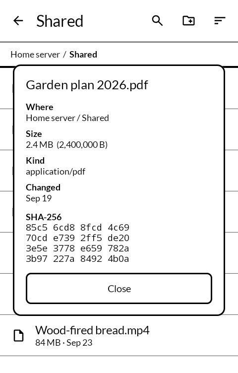
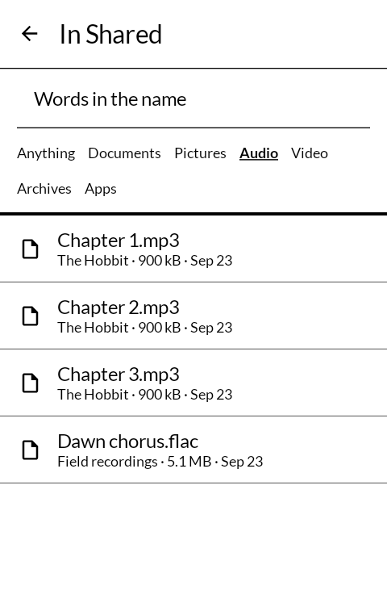

# 棚 tana — Files

A file manager for an E Ink phone, and for the drives on the servers at home. Built for the
[Mudita Kompakt](https://mudita.com/products/kompakt/), and it will install on any Android 12
device.

*Tana* is 棚 — a shelf. Not a cabinet with a lock, not an archive: the plank on the wall where
things are put so they can be found again and taken down.

Not a fork. Written from scratch in Kotlin and Jetpack Compose, using Mudita's own
[MMD](https://github.com/mudita/MMD) design system so it looks like the apps the phone
already ships with. Berend Sliedrecht's [MonoFiles](https://github.com/berendsliedrecht/MonoFiles)
showed there was a gap for one; this is a different answer to the same question.

| | |
|---|---|
|  |  |
|  |  |

## Why it exists

The phone's own file manager is Android's, and it does nearly everything. It is also drawn for
a colour screen that scrolls smoothly, which this one does not, and it has never heard of the
drives plugged into the servers in the next room. The lightweight E Ink file managers look right
and do a third of the work: one file at a time, no search, no share.

The bar here is the Android one — everything it does that a person reaches for on a phone —
drawn for sixteen greys and a list that moves four rows at a time, and with the servers in it
as places like any other.

## What it does

- **A start page of places**, not the top of a tree: recent files, Downloads, phone storage,
  the SD card, folders you pinned, and your servers.
- **Choose several things at once.** A long press starts choosing; a press adds or takes away;
  "All" takes the folder. Then copy, move, delete, share.
- **Copy and move by carrying.** Pick things up with Copy or Move, go anywhere — another folder,
  the SD card, a server — and Paste. A phone and a server are the same to it, so a copy from
  one to the other is the same two presses as a copy between two folders.
- **Copies that cannot half-happen.** A file is written under a temporary name and takes its
  real name only once every byte has arrived and the size is checked. A move is a copy and then
  a delete, and the original is deleted only after all of it has arrived. Stop a copy half way
  and what had arrived is kept, and nothing half-written is left behind. Long copies carry on
  with the screen off, with a notification that can stop them.
- **Asks about names already taken**, before it starts: keep both, leave those out, or replace
  — and replace asks a second time in its own face, because it is the one that deletes.
- **Servers.** Any Samba or Windows share, signed in as a guest or with a user and password.
  Browse, open, copy either way, rename, delete, make folders. A file on a server is fetched to
  the phone to be opened or shared. Away from home it reaches whatever the phone can reach, so a
  server's Tailscale address works with Tailscale on.
- **Search** by name below the folder you are in, or everywhere on the phone: every word you type
  has to be in the name, in any order. Narrow it to documents, pictures, audio, video, archives
  or apps.
- **Sort** by name, date, size or type, and turn it round. Numbers sort as numbers, so chapter 2
  comes before chapter 10. Folders always come first.
- **Opens a file in the app that handles it**, or asks which with Open with. **Installs an
  APK** — the installer asks once whether to allow installs from here.
- **Info**: size, where, when, and — on request, because it means reading the whole file — its
  SHA-256, set out in fours so it can be read against a checksum posted somewhere else.
- **Rename, new folder, show hidden files**, and a path along the top where each step is a press
  back to it.

## What it does not do

No thumbnails: a photograph at the size of a list row is a grey smudge on this screen. No
`Android/data`: Android 12 lets no app into another app's private folders. Other apps' own
storage — Termux's, say — is reached through Android's file picker, not a path, and is not here;
the system Files app still does that. Nothing is sent anywhere but to the servers you add.

## Where this is up to

Version 0.1.0. The copy, move, delete and search engine is unit tested against real folders —
including a copy stopped half way, and a write that fails while replacing a file, where the old
file has to survive. A second suite runs against a real Samba share when one is named, and
passes: a five-megabyte folder there and back byte for byte, an upload stopped half way leaving
nothing on the server, a connection left idle for ninety seconds still answering at once.

Every screen has been driven on an Android 12 emulator the size of a Kompakt, against a real
server: the checksum the app worked out for a file on the server matched the server's own. What
has not happened yet is anybody using it on the phone for a week.

## Building

```
./gradlew assembleDebug
```

A release build needs a keystore at `signing/signing.keystore` with a matching
`signing/signing.properties`. There is no fallback key in this repository: without one, a
release build comes out unsigned rather than wrongly signed.

## Getting it, and keeping it

Download <https://github.com/wanderwildwood/tana/releases/latest/download/tana.apk> and
sideload it. That address always points at the newest release, and every release publishes a
`.sha256` beside the APK if you would rather check than trust.

For updates without doing this by hand, add this repository to
[Obtainium](https://github.com/ImranR98/Obtainium):

    https://github.com/wanderwildwood/tana

It will offer each new release as it appears. **The application id is settled** — updates
install over what you have, keeping your settings and anything the app has stored.

## Licence

GPL-3.0-only. See [LICENSE](LICENSE).

Copyright (C) 2026 wander wildwood

This program is free software: you can redistribute it and/or modify it under the terms of the
GNU General Public License as published by the Free Software Foundation, version 3.

This program is distributed in the hope that it will be useful, but WITHOUT ANY WARRANTY;
without even the implied warranty of MERCHANTABILITY or FITNESS FOR A PARTICULAR PURPOSE. See
the GNU General Public License for more details.

You should have received a copy of the GNU General Public License along with this program. If
not, see <https://www.gnu.org/licenses/>.

A file manager holds the keys to everything on a phone and, here, to the drives at home too.
Copyleft means nobody can ship this code with something added that they will not show you.

Servers are reached through [smbj](https://github.com/hierynomus/smbj) (Apache-2.0) and
[Bouncy Castle](https://www.bouncycastle.org/) (MIT). Icons are from Material Symbols,
Apache 2.0.
